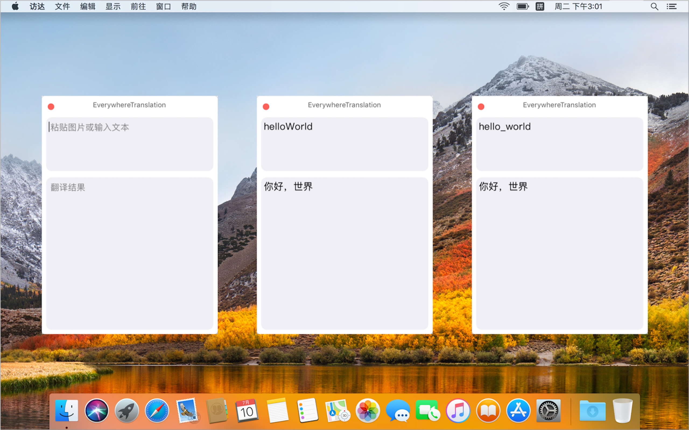

# EverywhereTranslation

------

1. 打开**EverywhereTranslation** 
   - **特性**
      1. 自动检测中英文, 支持中英文互译, 支持图片 ocr 文字识别. 
      2. 自动拆分驼峰和下划线命名规则的字符 
      3. 提供 [**PopClip插件**](https://share.weiyun.com/5M6EGAn)
      4. 双击 cmd 按键,使用**PopClip**插件 和 通过服务出现的时候, 窗口自动调整位置到当前鼠标位置附近 
      5. 应用失去焦点后窗口自动隐藏,支持大小调整, 极简UI 
2. **使用方式**
    - **文字**
      1. 切换到应用, 在输入框中, 输入文本 
      4. 在任意应用中,复制一段文字, 双击 cmd 按键, 
      5. 在任意应用中,选中一段文字, 右键  - 服务 - "使用 **EverywhereTranslation** 翻译”,  
      6. 在任意应用中,选中一段文字,如果和当前应用没有快捷键冲突,  **shift + cmd + U/E** 调用系统服务翻译 
      7. 在任意应用中, 使用**PopClip**插件,直接调用翻译 
    - **图片**
        1. 在任意应用中, 选中图片, 右键, EverywhereTranslation打开 
        2. 任意处拖动图片到 dock 图标 
        3. 任意截图软件, 截图到剪切板, 切换到EverywhereTranslation, cmd + v 粘贴识别 
